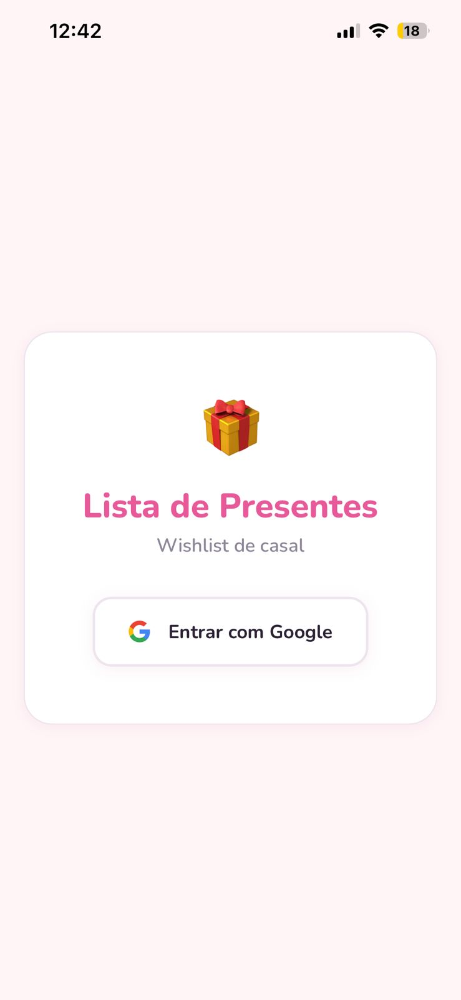
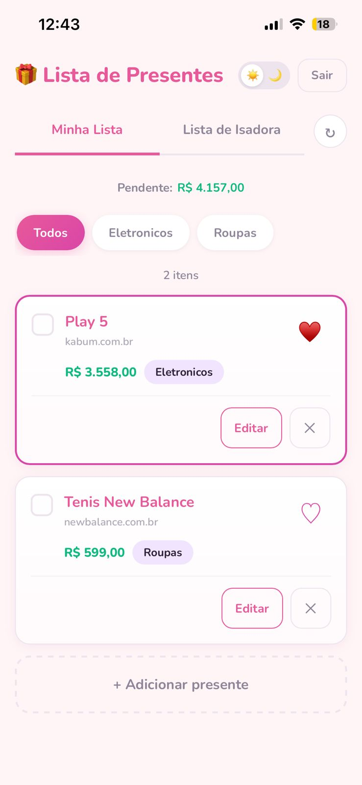
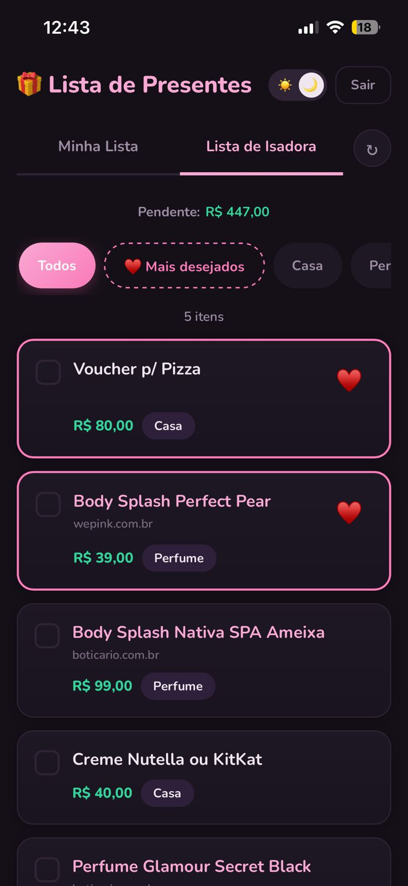

# Lista de Presentes

Fiz esse app para mim e minha esposa. A ideia é simples: cada um coloca o que quer ganhar de presente e o outro consegue ver a lista para saber o que comprar.

## Screenshots

<p align="center">
  
  
  
</p>

## O que dá para fazer

- Logar com Google (Só eu e ela temos acesso)
- Adicionar presentes com nome, link, preço e categoria.
- Favoritar os que mais quer
- Marcar como comprado
- Ver a lista do outro sem poder editar
- Filtrar por categoria
- Dark mode
- Funciona como app no celular (adicionar na tela inicial pelo Safari)

## Feito com

- Next.js 14
- Supabase (banco de dados e login)
- CSS Modules
- Hospedado na Vercel

## Como rodar

```bash
git clone https://github.com/breno-camargo/listadepresentess.git
cd listadepresentess
npm install
```

Cria um `.env.local` com base no `.env.local.example` e roda as migrations no Supabase (pasta `supabase/migrations/`).

```bash
npm run dev
```
